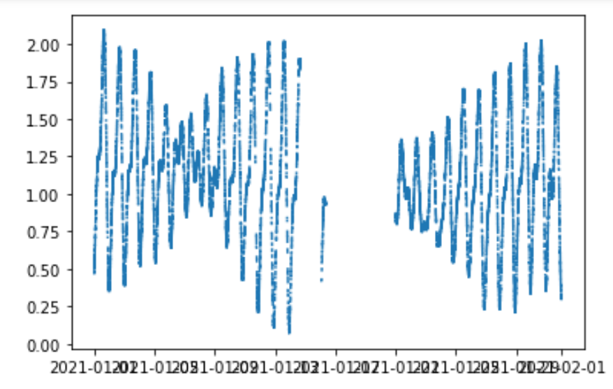
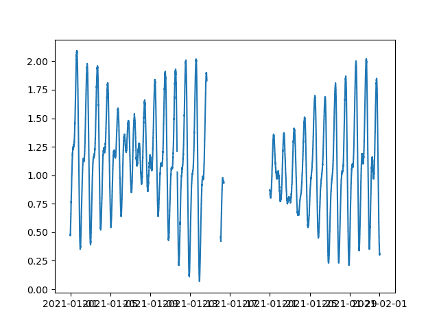

# 本工程为海气相关数据爬取的汇总项目  
```js
.  
├── main.py  // 
├── ioc_station_spider.py // 爬取 ioc station 数据爬虫
├── ioc_dist_codes_output.py // 从数据库中获获取所有站点的数据并输出为df
├── ioc_dist_codes_standard_output.py // 标准化爬取到的数据，只保留分钟级数据
├── ioc_dist_codes_deviation.py // 对分钟级标准化数据进行插值，对于缺失的部分补齐
├── ioc_dist_filterformat.py // 按照 起止时间 进行过滤，并按照ts列，对重复的行进行合并
```
### 1- `ioc_station_spider` - 爬取 ioc station 数据爬虫  
爬取ioc 海洋站rad数据，爬取地址为: `https://www.ioc-sealevelmonitoring.org/bgraph.php?code=shek&output=tab&period=30&endtime=2022-01-01`  
```js 
options: 
    code: // 站名
    period: // 以endtime向前推 x 天
    endtime: // 结束时间(utc)
```
以下为主要步骤:
#### step-1: ioc网站爬取数据

#### step-2: 数据标准化

#### step-3: csv转txt


生成的结果集:  
文件格式

```js
index //标记行
dt //对应时间(utc)
ts //时间戳
rad // 爬取的海洋站的观测值
```
目录结构
```js
.  
├── qinglan_2021_source // 样例存储子目录
│ ├── qinglan_2021_all.csv  // 爬取的原始文件
│ ├── qinglan_2021_fill_minutes.csv // fillna 填充后的指定年份的 sep为1min 数据集
│ ├── qinglan_2021_split_hours.csv  // 提取 sep为1h的数据集
│ ├── qinglan_2021_split_hours.txt  // sep=1h -> txt 每行对应当日的24个时刻的数据
```

### 2- `ioc_dist_codes_output.py` - 24年修改为通过数据库获取过去一年全部的共享潮位数据  
* 1: 使用sql拼接，并按照`ts`进行升序排列，输出为`.csv`格式
### 3- `ioc_dist_codes_standard_output.py` - 将step2输出的原始数据只取分钟数据

### 4- `ioc_dist_codes_deviation` -将step3的分钟级数据进行插值处理

### 4- 原始 `ioc_station_deviation.py` - 对爬取的 ioc station 数据进行差值处理    
 * 1: 先将原始数据，按照 limit 设置一定长度，进行线性插值，获得 原始 与 插值后 两个 df  
 * 2: 对差值后的 df 与 原始df进行比对处理，将在原始数据中连续nan超过60并进行差值的数据还原为 nan    
原始数据:

差值但为按照limit进行取nan:

差值并对累计超过limit上线的差值取nan:


### 5- `ioc_dist_filterformat` - 对step4插值后的数据剔除ts重复的行，按照起止时间进行过滤